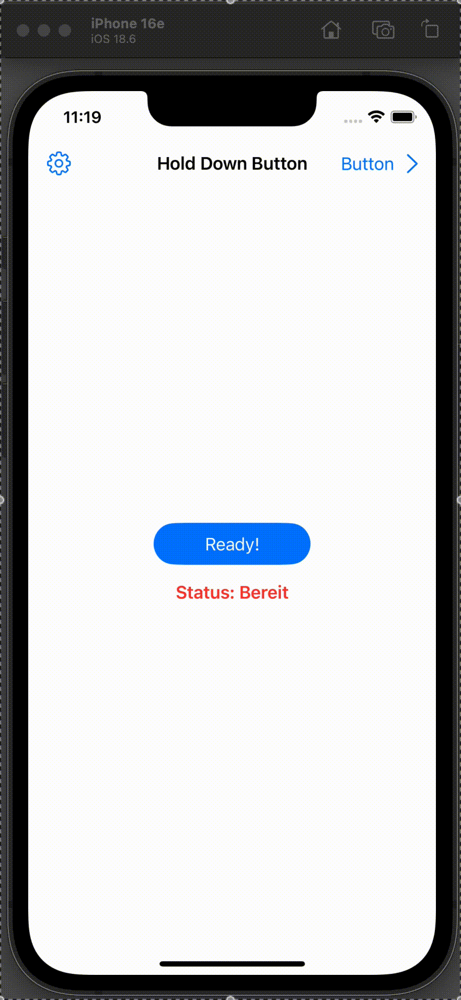
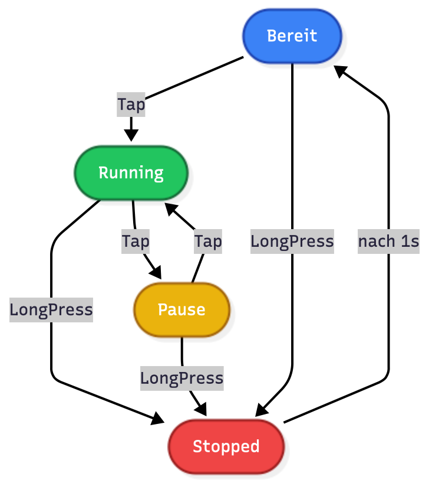

# HoldDownButton2 Demo App

A SwiftUI demo app for a customizable “Hold Down Button” with status display, progress bar, and AppNavigation.
The toolbar can be used to navigate to demo and settings pages.

## Features

- **HoldDownButton2**: A button that displays different statuses (Start, Pause, Stop, Ready) and provides a progress bar when pressed and held.
- **Customizable colors and texts**: Default values for status texts and colors can be changed centrally or overwritten on the button.
- **Navigation**: NavigationStack with sample pages (demo, settings) and toolbar buttons.

<p align="center">
  
</p>


## Main components

- `HoldDownButton2`: The main button with status and progress display.
- `ContentView`: Start view with navigation and example of button usage.
- `NavigationButton`: Auxiliary view for NavigationStack.
- `DemoView_` and `SettingsView_`: Example pages for navigation.

## Function
  
<p align="center">
  
</p>


## How to use

The button returns the status with
```swift
HoldDownButton2...
...
onStateChange: { status in
   handleButtonStatus(status)
   }
...
```
   
### Example of use
```swift
func handleButtonStatus(_ status: ButtonStatus2) {
    // Aktionen ausführen
}
```


## Requirements

- macOS
- Xcode 16
- SwiftUI

## Getting started

1. clone from GitHub
2. Open the project in Xcode.
3. Run (`Cmd+R`).

---
